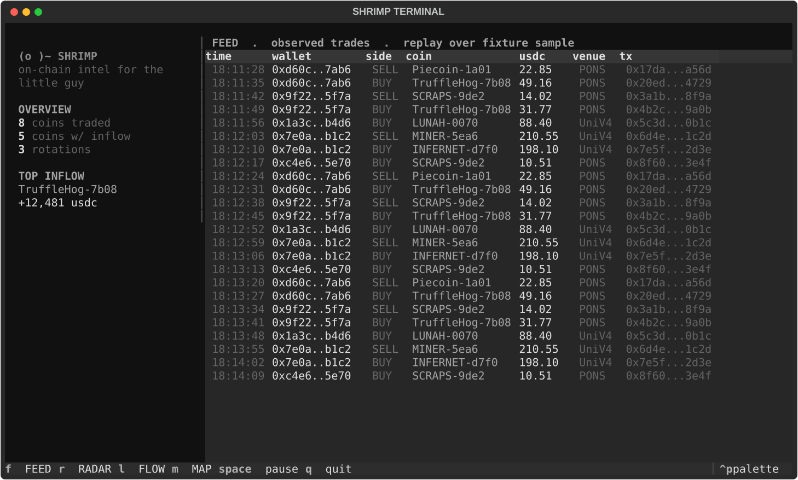

<div align="center">

```
                          ___
                       .-'   `-.
                     .'   .-.    `.
                    /    ( o )     \
                   |      `-'    .-.|
                   |          .-'   |
                    \        /    .-'
                 /\  `.____.'  _.-'
                 \/\       _.-'
                 /\/`.__.-'`
                 \/\/
                  `'
```

# SHRIMP TERMINAL

**on-chain intel for the little guy · Robinhood Chain · read-only**


</div>

---

> Whales have Bloomberg terminals. **Shrimp** have this one.

**Shrimp Terminal** is a read-only explorer of the trades happening right now on
supported Robinhood Chain venues — PONS v2 bonding curves and the Uniswap v4
pools their coins graduate into. It turns raw chain logs into things a small
trader can actually read: a live feed, a ranked inflow board, the wallet
rotations that move a coin, and the whales moving with them — always with the
addresses, timestamps and transaction hashes behind every number.

It does **not** give financial advice, does **not** claim money flows between
coins, does **not** attribute wallets to people, and does **not** promise
returns. It shows you what the chain recorded, and where to check it yourself.

## Quickstart

```bash
git clone https://github.com/OWNER/shrimp-terminal
cd shrimp-terminal

# The plain CLI runs with zero dependencies on a fixture sample:
python -m shrimp            # banner + commands
python -m shrimp feed       # stream of observed trades
python -m shrimp radar      # ranked observed inflow (the board)
python -m shrimp rotations  # wallets that sold A then bought B, graded

# The full-screen terminal (optional):
pip install textual
python -m shrimp tui
```

No RPC keys, no account, nothing to sign. The shipped data is a small recorded
sample so the terminal looks alive on the first command; a live Robinhood Chain
adapter plugs in behind the same commands later.

## Four views, one dataset



| View | Hotkey | What it shows |
|------|:------:|---------------|
| **FEED**  | `F` | every observed trade in the order it happened, with tx hashes |
| **RADAR** | `R` | coins ranked by observed inflow, with all parts visible |
| **FLOW**  | `L` | sold-A → bought-B rotations grouped by route |
| **MAP**   | `M` | coins laid out by venue, sized by observed inflow |

`Space` pauses the replay; `Q` quits. The top bar is the shared session clock —
mode (`FIXTURE` / `REPLAY` / `LIVE`) and UTC time, mirrored on every view.

## What it does for a shrimp

Beyond rotations (*sold A → bought B*), the terminal gives a small trader a
whale's-eye view of the same public data:

| Module | Shows | Why a shrimp cares |
|--------|-------|--------------------|
| 🐋 **Whale Watch** | large wallets entering / exiting a coin | see where the crowd is going |
| 🧠 **Smart Money** | wallets with strong observed history | spot informed buyers early |
| 🥚 **Fresh Launches** | new PONS curves + graduation tracker | catch a coin at the start |
| ⚠️ **Risk Radar** | liquidity pulls, dev sells, holder concentration | avoid the obvious rugs |
| 👜 **My Bags** | paste your address → your positions + who's moving near you | make it personal |
| 🔔 **Alert Journal** | what fired, and what price did 30 / 60 min later | keep yourself honest |

## From an event to evidence

One row from the recorded sample:

| Step | Observed fact | Where to check |
|------|---------------|----------------|
| **Wallet** | `0xd60c…7ab6` | address on the explorer |
| **Sell** | 3,640,335 Piecoin for 22.848 USDC on the PONS curve, block 59570827 | `tx 0x17da…7a56d` |
| **Buy** | 9,788,825 TruffleHog for 49.159 USDC on the PONS curve, block 59579393 | `tx 0x20ed…4729` |
| **Sequence** | sell Piecoin → buy TruffleHog, gap 866 s, grade `clean` (sold nothing else in the window) | `docs/EXAMPLES.md` |

**Grades:** `direct` — sell and buy in the same transaction · `clean` — the wallet
sold only A in the window · `ambiguous` — it also sold other coins (listed, never
counted in the weight). More worked cases, including negative ones, in
[`docs/EXAMPLES.md`](docs/EXAMPLES.md).

## How it works

```
Robinhood Chain logs ──▶ ingest      swap events + ERC-20 transfers, PONS lifecycle
        │
        ▼
     normalize ──▶ trades            who traded what (Transfer-based), exact block times
        │
        ▼
      rotate ──▶ sequences           sold A → bought B by one wallet in 5m / 30m / 2h, graded
        │
        ▼
       serve ──▶ CLI + TUI + API     one shared session clock: fixture | replay | live
        ├──▶ shrimp (CLI, stdlib)    FEED · RADAR · ROTATIONS
        ├──▶ shrimp tui (Textual)    FEED · RADAR · FLOW · MAP
        └──▶ api/ (FastAPI, later)   one dataset for the terminal and the web/ site
```

**What it does.** Reads public chain data, keeps every trade with its transaction
hash, and shows sequences in the order they happened. Replay and live are
separate modes, labelled on every screen. The radar score is a ranking of
observed inflow with all parts visible.

**What it does not.** It does not prove money flow between coins, does not
attribute addresses to people, does not send anything to the chain, and does not
promise returns.

## Project layout

```
shrimp-terminal/
├── shrimp/            # CLI + TUI  (one command: `shrimp`)
│   ├── cli.py         #   zero-dependency CLI: feed / radar / rotations
│   ├── models.py      #   Trade, Rotation, InflowRow
│   ├── data.py        #   fixture loading (live adapter plugs in here)
│   ├── theme.py       #   the shrimp palette, shared with web/
│   └── tui/           #   Textual full-screen terminal
├── data/fixtures/     # recorded sample so it runs with no setup
├── docs/EXAMPLES.md   # worked examples, including negative cases
├── api/               # FastAPI service            (planned)
└── web/               # Vite + React site          (planned)
```

## Roadmap

- [x] Repo skeleton, palette, fixtures, CLI (`feed` / `radar` / `rotations`)
- [x] Full Textual TUI — FEED (live replay) · RADAR · FLOW · MAP, shared clock
- [ ] Whale Watch · Smart Money · Fresh Launches · Risk Radar · My Bags
- [ ] Live Robinhood Chain adapter (Alchemy / public RPC / indexer)
- [ ] FastAPI service + `web/` site sharing one dataset
- [ ] Alert journal with 30 / 60-minute outcomes

## Data & limits

The shipped sample is small and synthetic-but-shaped-like-real, for demoing the
UI. Live data quality depends on the chosen RPC/indexer. Nothing here is
financial advice; the authors are not advisors. Read-only: the terminal never
signs or sends a transaction.

## License

MIT — see [`LICENSE`](LICENSE).
